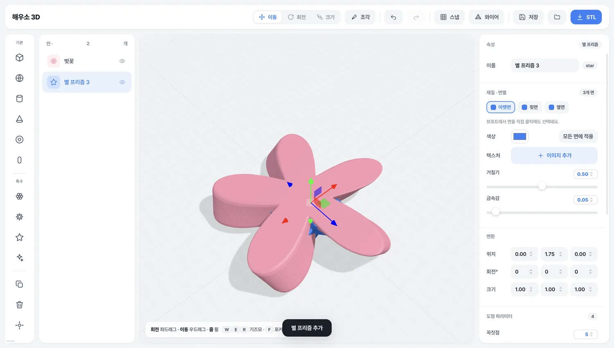

# 해우소 3D

파라메트릭 3D 모델링 도구. 상자와 구에서 시작해 모디파이어를 쌓고, 면마다 칠하고,
모서리를 골라 둥글립니다. 만든 건 STL로 내보내 그대로 3D 프린터에 넘길 수 있습니다.

**[소개 사이트](https://seongpark.github.io/haeuso-3d/)** · **[다운로드](https://github.com/seongpark/haeuso-3d/releases/latest)** (macOS)



## 기능

- **파라메트릭 도형** — 상자·구·원기둥·원뿔·토러스·캡슐, 그리고 꽃·기어·별 프리즘
- **모디파이어 스택** — 비틀기·구부리기·테이퍼·물결·노이즈·꽃잎화를 겹쳐 쌓고 순서를 바꿉니다
- **모서리 둥글기** — 조건에 맞는 모서리를 전부, 또는 뷰포트에서 클릭해 고른 모서리만
- **면별 재질** — 면마다 색과 텍스처를 따로. 상자는 6면, 별·꽃·기어는 윗면/아랫면/옆면
- **불리언** — 합치기 / 빼기 / 교차 (three-bvh-csg)
- **조각** — 브러시로 정점을 직접 밀어 다듬기
- **STL 내보내기** — 3D 프린터로
- 되돌리기 80단계, `.haeuso` 파일로 저장

인터넷 없이 동작합니다. 계정도 서버도 없습니다.

## 설치

[Releases](https://github.com/seongpark/haeuso-3d/releases/latest)에서 dmg를 받아
앱을 응용 프로그램 폴더로 끌어다 놓으면 됩니다.

| 파일 | 대상 |
|---|---|
| `Haeuso3D-1.0.0-arm64.dmg` | Apple Silicon (M1 이후) |
| `Haeuso3D-1.0.0.dmg` | Intel |

개인이 만든 앱이라 애플 공증을 받지 않았습니다. 처음 열 때
**“확인되지 않은 개발자”** 경고가 뜨면, 앱을 우클릭한 다음 **열기**를 고르면 됩니다.
한 번만 확인하면 그 뒤로는 평소처럼 열립니다.

## 개발

```bash
npm install
npm start            # 앱 실행
npm run dist:mac     # dmg 빌드 → dist/
```

`index.html` 한 파일이 앱 전체입니다. three.js는 `vendor/`에 넣어 두어
CDN 없이 동작합니다.

| 파일 | 역할 |
|---|---|
| `index.html` | 앱 본체 (UI·지오메트리·모디파이어) |
| `main.js` | Electron 메인 — 창, 메뉴, 파일 열기/저장 |
| `preload.js` | 렌더러에 노출할 API만 통과시키는 다리 |
| `vendor/` | three.js, three-bvh-csg, Pretendard |
| `docs/` | 소개 사이트 (GitHub Pages) |

### 빌드 시 주의

`build.productName`은 반드시 ASCII여야 합니다. Electron이 `CFBundleName`으로
헬퍼 프로세스 경로를 찾는데, 한글 이름은 파일시스템 유니코드 정규화 차이로
조회에 실패해 앱이 즉시 죽습니다. 화면에 보이는 이름은
`mac.extendInfo.CFBundleDisplayName`이 담당합니다.

## `.haeuso` 파일 형식

첫 줄에 매직과 버전, 그 아래 JSON 본문입니다.

```
HAEUSO3D/1
{"v":3,"sel":0,"objects":[...]}
```

## 라이선스

개인 프로젝트입니다. 별도 라이선스를 정하지 않았습니다.

번들에 포함된 [three.js](https://github.com/mrdoob/three.js)(MIT),
[three-bvh-csg](https://github.com/gkjohnson/three-bvh-csg)(MIT),
[Pretendard](https://github.com/orioncactus/pretendard)(OFL 1.1)는
각자의 라이선스를 따릅니다.
